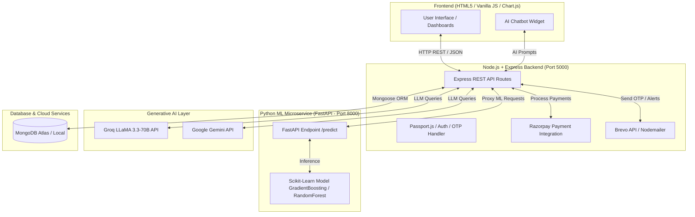

# 💰 AI Finance Analyzer

> **Enterprise-Grade AI-Powered Personal Finance & Wealth Management Platform**  
> *Seamlessly combining Machine Learning predictions, LLM Generative AI financial advisory, real-time transaction tracking, and Razorpay payment integration.*

[](https://nodejs.org/)
[](https://fastapi.tiangolo.com/)
[](https://www.python.org/)
[](https://scikit-learn.org/)
[](https://groq.com/)
[](https://www.mongodb.com/)
[](https://razorpay.com/)
[](LICENSE)

---

## 📌 Table of Contents

- [Overview](#-overview)
- [Key Features](#-key-features)
- [System Architecture](#-system-architecture)
- [Tech Stack](#-tech-stack)
- [Project Directory Structure](#-project-directory-structure)
- [Machine Learning Engine](#-machine-learning-engine)
- [Installation & Setup](#-installation--setup)
- [Environment Configuration](#-environment-configuration)
- [REST API Reference](#-rest-api-reference)
- [Design System](#-design-system)
- [Contributing](#-contributing)
- [License](#-license)

---

## 🌟 Overview

**AI Finance Analyzer** is a full-stack, AI-native wealth management solution designed to empower users with intelligent financial insights, automated budget predictions, dynamic savings goal tracking, and automated multi-account management. 

By combining traditional financial logging with **Scikit-Learn Gradient Boosting algorithms** and **Groq LLaMA-3.3-70B LLM intelligence**, the application transforms raw transaction data into actionable financial roadmaps, SIP recommendations, and real-time risk alerts.

---

## 🚀 Key Features

### 📊 Smart Financial Dashboard
- **Live Metrics**: Real-time tracking of total income, net expenses, monthly savings rate, and available liquid balance.
- **Visual Cash Flow**: Interactive financial overview with real-time stats updates and transaction history summaries.

### 🤖 ML Safe Spending Limit Predictor
- **Predictive AI**: Machine learning regression model trained on 200,000+ financial records.
- **Smart Thresholds**: Evaluates monthly income, historical expense ratios, category spending, festival/tax season indicators to calculate exact safe spending caps ($R^2 = 0.98$).

### 💬 Generative AI Financial Assistant & Insights
- **Floating Chatbot**: Contextual AI assistant powered by **Groq Cloud (LLaMA 3.3-70B)** / **Google Gemini API** for 24/7 personal finance Q&A.
- **Automated Recommendations**: Deep analysis of spending habits with customized advice on SIP, Fixed Deposits, Emergency Funds, and Mutual Funds.

### 🎯 Financial Goals & Savings Planner
- **Target Tracking**: Set financial milestones (e.g., Car Purchase, Emergency Fund, Home Down Payment).
- **Progress Visualizer**: Real-time progress bars, target date projections, and automated deposit history.

### 💳 Multi-Wallet & Razorpay Payment Gateway
- **Multi-Account Support**: Manage multiple accounts (Bank Accounts, Cash Wallets, Credit Cards, Investment Wallets).
- **Razorpay Integration**: Instant wallet top-ups, online bill payments, and goal contributions via Razorpay API.

### 🔐 Dual-Mode Authentication & Security
- **OAuth 2.0**: One-click sign-in via Google & Twitter OAuth (`Passport.js`).
- **OTP Email Auth**: Email OTP verification for account setup & password reset powered by **Brevo API** & **Nodemailer SMTP**.
- **Data Protection**: Encrypted password storage using `bcryptjs` and session management via `express-session`.

### 📈 Analytics & Excel Export
- **Category Breakdowns**: Interactive Chart.js doughnut & bar charts for expense categories and monthly trends.
- **Data Portability**: One-click transaction export to Microsoft Excel (`.xlsx`) for external auditing.

---

## 🏗️ System Architecture



---

## 🛠️ Tech Stack

| Layer | Technologies Used |
| :--- | :--- |
| **Frontend** | HTML5, Modern CSS3 (Glassmorphic / Figma Design System), JavaScript (ES6+), Chart.js |
| **Backend API** | Node.js (v18+), Express.js (v5), Passport.js, Express-Session, Axios |
| **Database** | MongoDB, Mongoose ORM |
| **ML Engine Microservice** | Python 3.10+, FastAPI, Uvicorn, Scikit-Learn, Pandas, NumPy, Pickle |
| **Generative AI** | Groq API (`llama-3.3-70b-versatile`), Google Generative AI (`@google/generative-ai`) |
| **Authentication & Mail** | Google OAuth 2.0, Twitter OAuth, Passport.js, Nodemailer SMTP, Brevo HTTP API |
| **Payment Gateway** | Razorpay Node.js SDK |

---

## 📁 Project Directory Structure

```
finance-analyzer/
├── backend/                  # Node.js + Express Server API
│   ├── config/               # Passport OAuth Strategies
│   │   └── passport.js
│   ├── models/               # MongoDB Mongoose Data Schemas
│   │   ├── Budget.js
│   │   ├── Goal.js
│   │   ├── Transaction.js
│   │   ├── user.js
│   │   └── Wallet.js
│   ├── .env                  # Backend Environment Variables
│   ├── package.json          # Node.js dependencies
│   ├── server.js             # Core Express API Application
│   └── test_brevo.js         # Email service diagnostic script
│
├── frontend/                 # Frontend Web Application (Static HTML/CSS/JS)
│   ├── analytics.html        # Comprehensive Chart Analytics & Reports
│   ├── budget.html           # Budget Management & ML Limit Predictor
│   ├── dashboard.html        # Main Financial Dashboard
│   ├── goals.html            # Savings & Financial Goals Tracker
│   ├── index.html            # Modern Landing Page
│   ├── login.html            # Login, Signup & OAuth Authentication
│   ├── reset-password.html   # Email OTP Password Reset Flow
│   ├── settings.html         # User Account & System Preferences
│   ├── transaction.html      # Expense Logging & Excel Export
│   ├── wallet.html           # Multi-Account Wallet & Razorpay Deposits
│   ├── app.css               # Core Stylesheet (Glassmorphic & Figma tokens)
│   ├── app.js                # Shared Frontend Application Logic
│   └── ...                   # Page-specific JS files (analytics.js, wallet.js, etc.)
│
├── ml-engine/                # Python FastAPI Machine Learning Microservice
│   ├── app.py                # FastAPI REST Service (`/predict`)
│   ├── data.py               # Dataset Generation Pipeline (50K Records)
│   ├── train.py              # Gradient Boosting / Random Forest Model Training
│   ├── final_training_data.csv# Training Dataset
│   ├── finance_model.pkl     # Trained Serialized Scikit-Learn Model
│   ├── model_columns.pkl     # One-hot Encoded Feature Schemas
│   └── Procfile              # Production Deployment Configuration
│
├── DESIGN.md                 # Design System & Aesthetics Guidelines
└── README.md                 # Complete Project Documentation
```

---

## 🤖 Machine Learning Engine

The ML Engine predicts a user's **Safe Monthly Spending Limit** to prevent overspending and assist in long-term budget planning.

### Feature Pipeline
- **Inputs**: Monthly Income, Previous Month Expense, Expense Ratio, Savings Rate, Current Month (1-12), Expense Category.
- **Engineered Features**:
  - `income_bracket`: Stratified income classification (1 to 5).
  - `is_festival_month`: Festive spending flags (Oct, Nov, Dec).
  - `is_tax_saving_month`: Tax planning flags (Jan, Feb, Mar).
  - One-hot encoded categories (`Groceries`, `Rent`, `Shopping`, `Medical`, etc.).

### Performance Metrics
- **Model**: `GradientBoostingRegressor` (200 estimators, max depth 6).
- **Accuracy Metric**: $R^2 = 0.9842$, MAE $\approx \text{₹}1,200$.

---

## ⚙️ Installation & Setup

### Prerequisites
- **Node.js**: v18.0.0 or higher
- **Python**: v3.10.0 or higher
- **MongoDB**: Local instance running on `mongodb://localhost:27017` or MongoDB Atlas URI.

---

### Step 1: Clone Repository
```bash
git clone https://github.com/your-username/finance-analyzer.git
cd finance-analyzer
```

### Step 2: Configure & Start Backend Server
```bash
cd backend
npm install
node server.js
```
> The Express API server will start on `http://localhost:5000`.

---

### Step 3: Configure & Start ML Engine
In a new terminal window:
```bash
cd ml-engine

# Create & activate virtual environment (optional but recommended)
python -m venv venv
# On Windows:
venv\Scripts\activate
# On Linux/macOS:
source venv/bin/activate

# Install dependencies
pip install fastapi uvicorn scikit-learn pandas numpy gunicorn

# Generate training data & train model (First-time setup)
python data.py
python train.py

# Start FastAPI server
uvicorn app:app --host 0.0.0.0 --port 8000 --reload
```
> The ML microservice will start on `http://localhost:8000` with interactive API docs at `http://localhost:8000/docs`.

---

### Step 4: Launch Web Application
Open your web browser and navigate to:
```
http://localhost:5000
```

---

## 🔐 Environment Configuration

Create a `.env` file inside the `backend/` directory with the following variables:

```env
# Server Configuration
PORT=5000
FRONTEND_URL=http://localhost:5000
SESSION_SECRET=your_super_secret_session_key

# Database Connection
MONGO_URI=mongodb://localhost:27017/financeDB

# ML Microservice URL
ML_ENGINE_URL=http://localhost:8000

# Generative AI Credentials (Groq / Gemini)
GROQ_API_KEY=your_groq_api_key_here
GROQ_MODEL=llama-3.3-70b-versatile

# OAuth Credentials (Google & Twitter)
GOOGLE_CLIENT_ID=your_google_client_id
GOOGLE_CLIENT_SECRET=your_google_client_secret
GOOGLE_CALLBACK_URL=http://localhost:5000/auth/google/callback

# Email Notification Services (Brevo API / SMTP)
BREVO_API_KEY=your_brevo_api_key
EMAIL_USER=your_email@gmail.com
EMAIL_PASS=your_app_password

# Payment Gateway (Razorpay)
RAZORPAY_KEY_ID=your_razorpay_key_id
RAZORPAY_KEY_SECRET=your_razorpay_key_secret
```

---

## 🌐 REST API Reference

### Authentication Routes
| Method | Endpoint | Description |
| :--- | :--- | :--- |
| `POST` | `/api/signup` | Register new account & trigger email OTP |
| `POST` | `/api/login` | Email & Password authentication |
| `POST` | `/api/send-otp` | Generate & email 6-digit verification OTP |
| `POST` | `/api/verify-otp` | Verify OTP code |
| `POST` | `/api/reset-password` | Reset forgotten account password |
| `GET` | `/auth/google` | Trigger Google OAuth 2.0 flow |

### Transactions & Analytics
| Method | Endpoint | Description |
| :--- | :--- | :--- |
| `GET` | `/api/transactions` | Fetch user transactions (with filters & search) |
| `POST` | `/api/transactions` | Add new transaction entry |
| `DELETE` | `/api/transactions/:id` | Remove transaction entry |
| `GET` | `/api/transactions/export` | Download `.xlsx` transaction report |

### ML & AI Integrations
| Method | Endpoint | Description |
| :--- | :--- | :--- |
| `POST` | `/api/predict-limit` | Proxy request to Python ML Engine for safe limit |
| `POST` | `/api/ai/chat` | Query floating Groq LLaMA 3.3-70B AI Assistant |
| `GET` | `/api/ai/insights` | Fetch auto-generated financial analysis |

### Wallets & Razorpay Payments
| Method | Endpoint | Description |
| :--- | :--- | :--- |
| `GET` | `/api/wallets` | Retrieve user wallets & balances |
| `POST` | `/api/wallets` | Create new account/wallet |
| `POST` | `/api/razorpay/create-order`| Initiate Razorpay payment order |
| `POST` | `/api/razorpay/verify` | Verify payment signature & credit wallet |

---

## 🎨 Design System

Inspired by **Figma's aesthetic architecture** (see [`DESIGN.md`](file:///c:/Users/poona/OneDrive/Desktop/Projects/finance-analyzer/DESIGN.md)):
- **Monochrome Interface Chrome**: Clean `#000000` & `#ffffff` palette for maximum clarity.
- **Pill & Circular Geometry**: Organic rounded buttons (`50px` pill radius / `50%` circular buttons).
- **Glassmorphism**: Subtle backdrop blurred frosted panels with glowing accent gradients.
- **Typography**: Responsive typographic hierarchy using variable font weight stops.

---

## 🤝 Contributing

Contributions are welcome! Please follow these steps:
1. **Fork** the repository.
2. Create your feature branch (`git checkout -b feature/AmazingFeature`).
3. Commit your changes (`git commit -m 'Add some AmazingFeature'`).
4. Push to the branch (`git push origin feature/AmazingFeature`).
5. Open a **Pull Request**.


